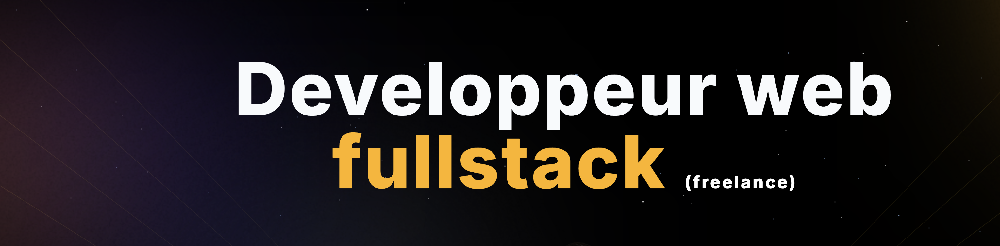

<h1 align="center">👨‍💻 𝐃𝐞́𝐯𝐞𝐥𝐨𝐩𝐩𝐞𝐮𝐫 𝐅𝐮𝐥𝐥𝐬𝐭𝐚𝐜𝐤 𝐅𝐫𝐞𝐞𝐥𝐚𝐧𝐜𝐞 | Spécialisation Frontend </h1>

<h3 align="center">Passionné par la création d'applications web performantes et intuitives, je suis un développeur Fullstack freelance avec une spécialisation en Frontend et une appétence pour l'UX/UI. Mon objectif est de concevoir des applications web avec des backend robustes et des interfaces utilisateurs fluides et modernes tout en garantissant une expérience optimale.</h3>

✅ Mes compétences techniques :

<ul align="justify">
<li>𝐅𝐫𝐨𝐧𝐭𝐞𝐧𝐝: Expertise avancée en React, Next.js, Vue.js et Angular avec une base solide en HTML5/CSS3 (SASS/SCSS, tailwind, mobile first)</li>
<li>𝐁𝐚𝐜𝐤𝐞𝐧𝐝: Maîtrise de Node.js (Express et NestJS) pour construire des API robustes et évolutives, ainsi qu'une solide expérience avec plusieurs autres frameworks backend comme Python/Django, Java/Spring Boot et PHP/Laravel.</li>
<li>𝐁𝐃𝐃: Expériences sur PostgreSQL, MongoDB, CouchDB.</li>
<li>𝐔𝐗/𝐔𝐈: Expérience dans la réalisation de parcours utilisateurs et de maquettes sous Figma ou Adobe XD.</li>
<li>𝐓𝐞𝐬𝐭: TDD, DDD, Jest, React Testing Library, Vitest, Playwright</li>
<li>𝐂𝐈/𝐂𝐃: Mise en place et gestion des pipelines CI/CD avec GitLab CI et GitHub Actions.</li>
<li>𝐃𝐞𝐯𝐎𝐩𝐬: Connaissances en Docker, Docker compose, Nginx et environnement Linux.</li>
</ul>

✅ Mes autres compétences :

<ul align="justify">
<li>𝐅𝐫𝐨𝐧𝐭𝐞𝐧𝐝: Expertise avancée en React, Next.js, Vue.js et Angular avec une base solide en HTML5/CSS3 (SASS/SCSS, tailwind, mobile first)</li>
<li>𝐁𝐚𝐜𝐤𝐞𝐧𝐝: Maîtrise de Node.js (Express et NestJS) pour construire des API robustes et évolutives, ainsi qu'une solide expérience avec plusieurs autres frameworks backend comme Python/Django, Java/Spring Boot et PHP/Laravel.</li>
<li>𝐁𝐃𝐃: Expériences sur PostgreSQL, MongoDB, CouchDB.</li>
<li>𝐔𝐗/𝐔𝐈: Expérience dans la réalisation de parcours utilisateurs et de maquettes sous Figma ou Adobe XD.</li>
<li>𝐓𝐞𝐬𝐭: TDD, DDD, Jest, React Testing Library, Vitest, Playwright</li>
<li>𝐂𝐈/𝐂𝐃: Mise en place et gestion des pipelines CI/CD avec GitLab CI et GitHub Actions.</li>
<li>𝐃𝐞𝐯𝐎𝐩𝐬: Connaissances en Docker, Docker compose, Nginx et environnement Linux.</li>
</ul>

<ul align="justify">
<li>📌 𝐀𝐠𝐢𝐥𝐢𝐭𝐞́: Utilisation de la méthodologie Agile.</li>
<li>📌 𝐐𝐮𝐚𝐥𝐢𝐭𝐞́: Application des best practices actuelles (clean code, SOLID, software craftsmanship, KISS, etc.)</li>
<li>📌 𝐂𝐨𝐥𝐥𝐚𝐛𝐨𝐫𝐚𝐭𝐢𝐨𝐧: Travail en équipe, code review, etc.</li>
<li>📌 𝐀𝐧𝐠𝐥𝐚𝐢𝐬: Anglais professionnel pour les échanges oraux et écrits.</li>
</ul>

🔗 N’hésitez pas à me contacter ou à consulter mon site pour en savoir plus !

